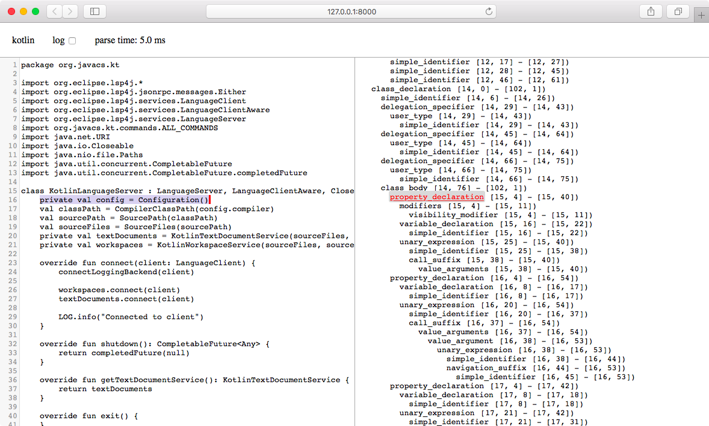

# Tree-Sitter Kotlin Grammar
[Kotlin](https://kotlinlang.org) language grammar for [Tree-Sitter](http://tree-sitter.github.io/tree-sitter/).

The grammar is based on the [official language grammar](https://kotlinlang.org/docs/reference/grammar.html).

_Note that the grammar is highly experimental and not suited for production usage yet!_

## Project Structure

| File | Description |
| ---- | ----------- |
| grammar.js | The Tree-Sitter grammar |
| grammar-reference.js | A direct translation of the Kotlin language grammar that is, however, ambiguous to Tree-Sitter |
| src | The generated parser |

## Setup

>`npm install`

## Development

### Compilation

To (re-)compile the grammar, run:

>`npm run generate`

Note that the grammar is written completely in JavaScript (`grammar.js`), the other source files are generated by `tree-sitter`.

### Testing

To run the unit tests, run:

>`npm run test`

## WebAssembly

### Compilation

First make sure to have [Emscripten](https://emscripten.org/) installed. If you use Homebrew, you can `brew install emscripten`. Then run:

>`npm run build-wasm`

### Web-UI

After compiling the grammar to WebAssembly, you can invoke

>`npm run web-ui`

to launch an interactive editing environment that displays the parsed syntax tree on-the-fly:

## Documentation

More documentation on how to create Tree-Sitter grammars [can be found here](https://tree-sitter.github.io/tree-sitter/creating-parsers).

## See also

* [Kotlin Language Server](https://github.com/fwcd/kotlin-language-server) for code completion, diagnostics and more
* [Kotlin Debug Adapter](https://github.com/fwcd/kotlin-debug-adapter) for JVM debugging support
